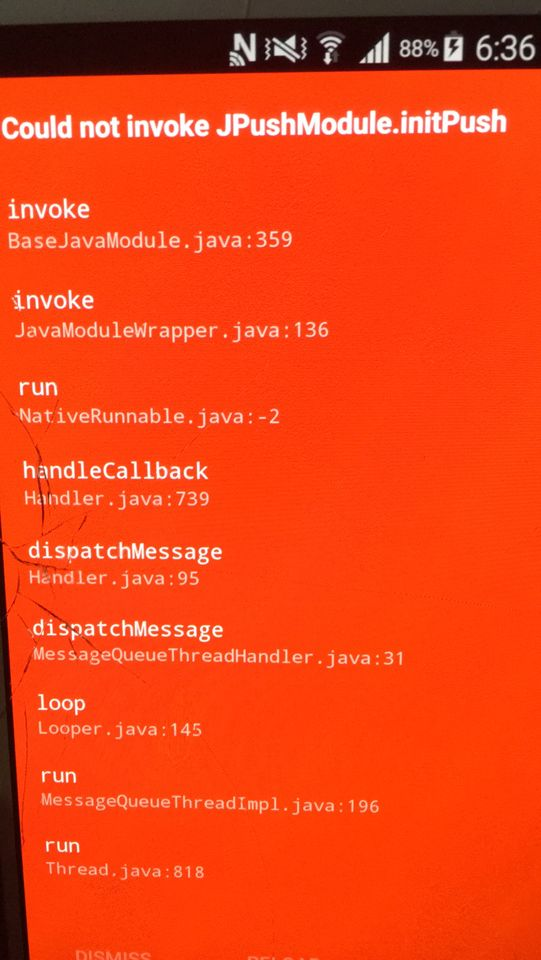
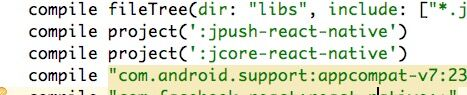

####极光推送论坛
[入口](community.jiguang.cn)

>环境：0.42
?windows 10 64
>JPush 1.5.2
>gradle 2.14

####0x01:JPushModule不执行
服务端没有返回

####0x02项目启动报错：Could not invoke JPushModule.initPush

问题原因：
>jpush 分离了 jcore，你没有配置好 jcore

解决方案：
>配置jcore

####0x03编译报错：java.io.IOException:Could not delete path ...

解决方案：
>delete app/build目录，然后重新编译
>如果还是报错就用管理员编译，重新编译会重新生成 build文件
>也可以直接 react-native start 
>然后在 Android Studio 中直接点击运行按钮

